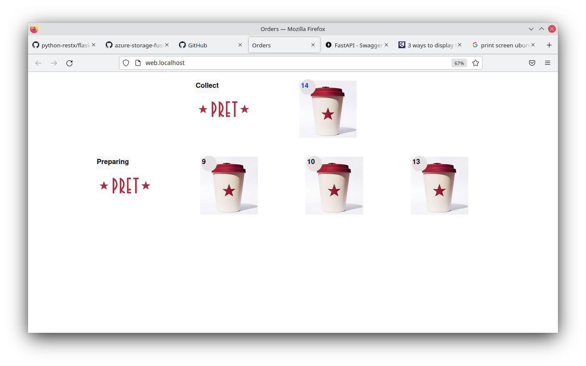

# About?

This is a fully functioning Order Ready dashboard with voice recogntion which you typically would see at a McDonalds or KFC restaurant that displays when your order is ready for collection.


[](https://youtu.be/cIWcak9ph7A)

## Features
* Dashboard display that shows new orders and orders ready for collection
* Shop branding
* Voice recognition - just say "order 53 ready" and the order will appear in the ready for collection stream
* Automatica cleandown of orders ready for collection
* Visual indication showing the food temperature

## Technical
The code is written in Python 


## Deployment
1. Install Docker and  Docker compose
2. docker-compose build
3. docker-compose up
4. goto http://web.localhost to see the order dashboard
5. goto http://api.localhost/docs to see the backend swagger api  
6. goto http://localhost:8080 to see traefik reverse proxy dashboard

## Development
```bash
$ virtualenv venv-order
$ source venv-order/bin/activate
$ pip install -r requirements.txt
$ cd speech
$ pip install -r requirements-speech.txt
```



