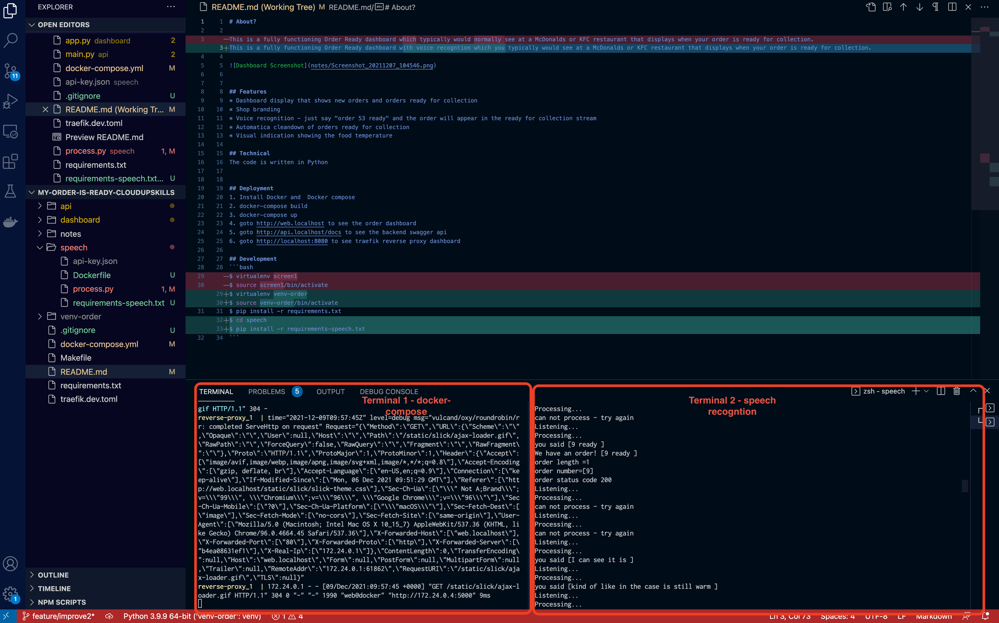

# About?

This is a fully functioning Order Ready dashboard with voice recogntion which you typically would see at a McDonalds or KFC restaurant that displays when your order is ready for collection. Using voice recogntion, the order is moved from the preparing state to the Collection state automatically. No Need to tap in any numbers!

## Motivation 1
I have been buying lots of coffeess from Pret recently as I have a Pret subscription which is great for me as I love my coffee! The frustrating however is that when the shop gets busy then the service levels drop and often my order has gone AWOL!

## Motivation 2
Mcdonalds already use a order dashboard system for cusotmers and also for delivery partners like Just Eat and Uber. I do however notice that the screen is often broken and then the staff members shout out the order! My system would listen to the ready order and display it immediately onto the dashboard.

## Video Demo
click on the the image! ( you will be directed to Youtube)

[](https://youtu.be/cIWcak9ph7A)

## Features
* Dashboard display that shows new orders and orders ready for collection
* Shop branding
* Voice recognition - just say "order 53 ready" and the order will appear in the ready for collection stream
* Automatica cleandown of orders ready for collection
* Visual indication showing the food temperature

## Technical
The code is written in Python, Flask, Javascript

### Devops
- Docker and Docker Compose 
- Makefile
- Traefik -reverse proxy
### api
- fast-api
- pydantic
### dashboard
- Flask
### speech recognition
- google cloud speech ( requires an api key and paid up service using GCP)
- speech recognition


## Deployment
1. Install Docker and  Docker compose
2. docker-compose build
3. docker-compose up
4. goto http://web.localhost to see the order dashboard
5. goto http://api.localhost/docs to see the backend swagger api  
6. goto http://localhost:8080 to see traefik reverse proxy dashboard

## Development
```bash
$ virtualenv venv-order
$ source venv-order/bin/activate
$ pip install -r requirements.txt
$ cd speech
$ pip install -r requirements-speech.txt
```

### Speech
- https://codelabs.developers.google.com/codelabs/cloud-speech-text-python3#7
- https://cloud.google.com/speech-to-text/docs/reference/rest

### 


